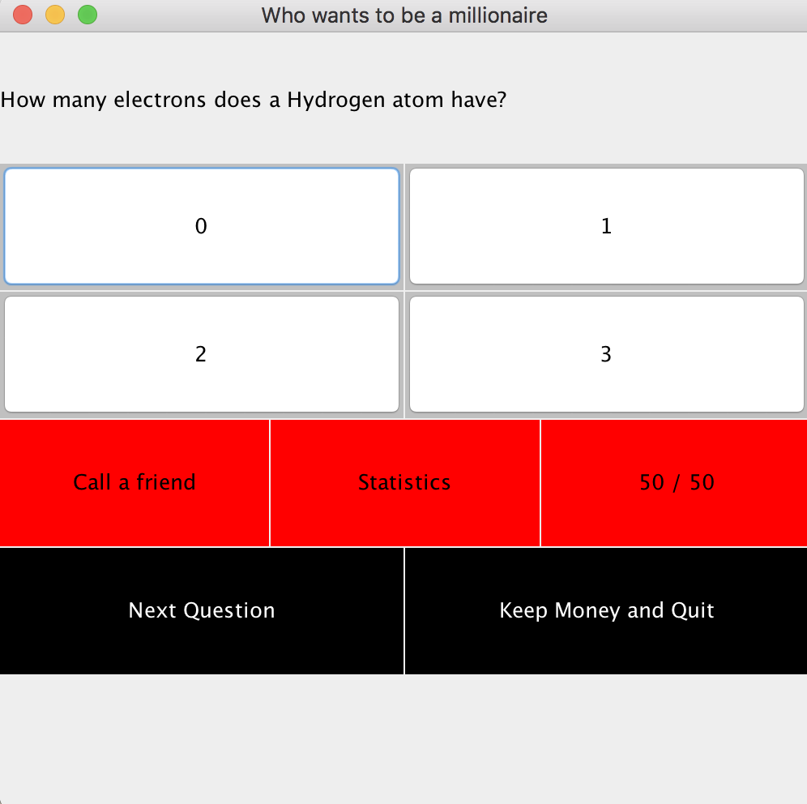
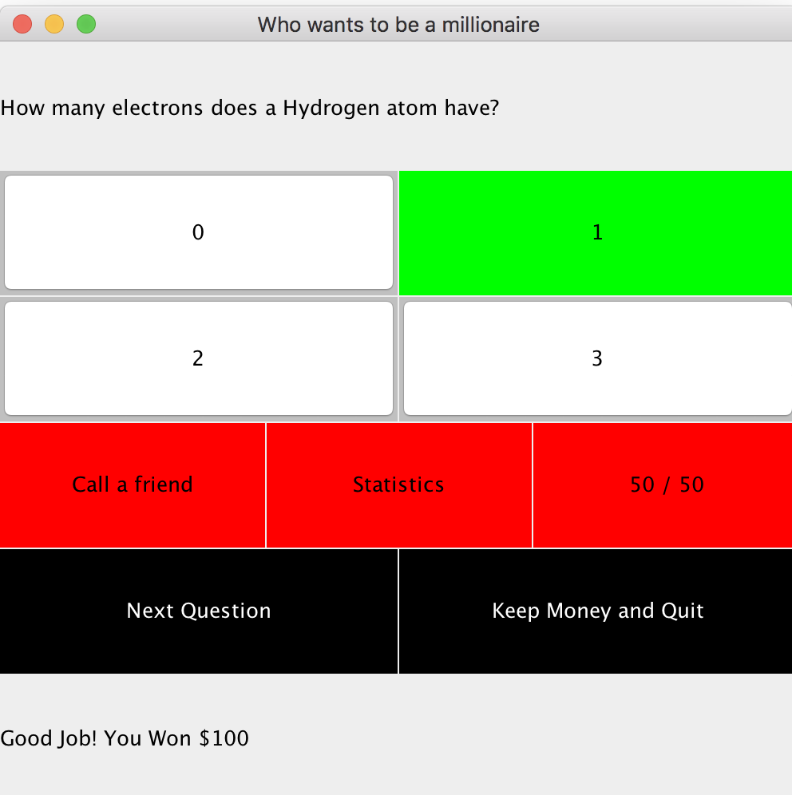
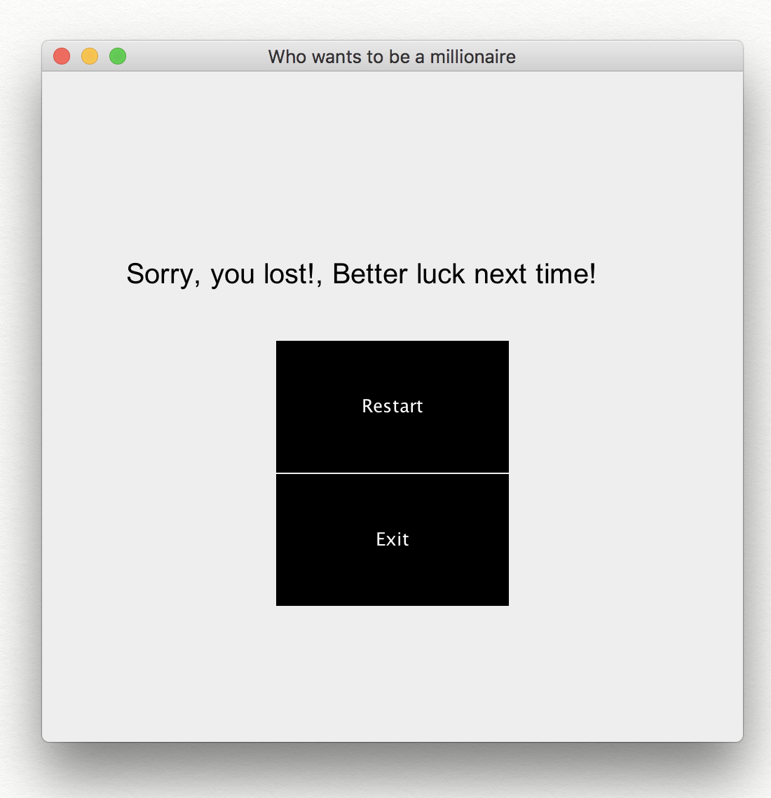
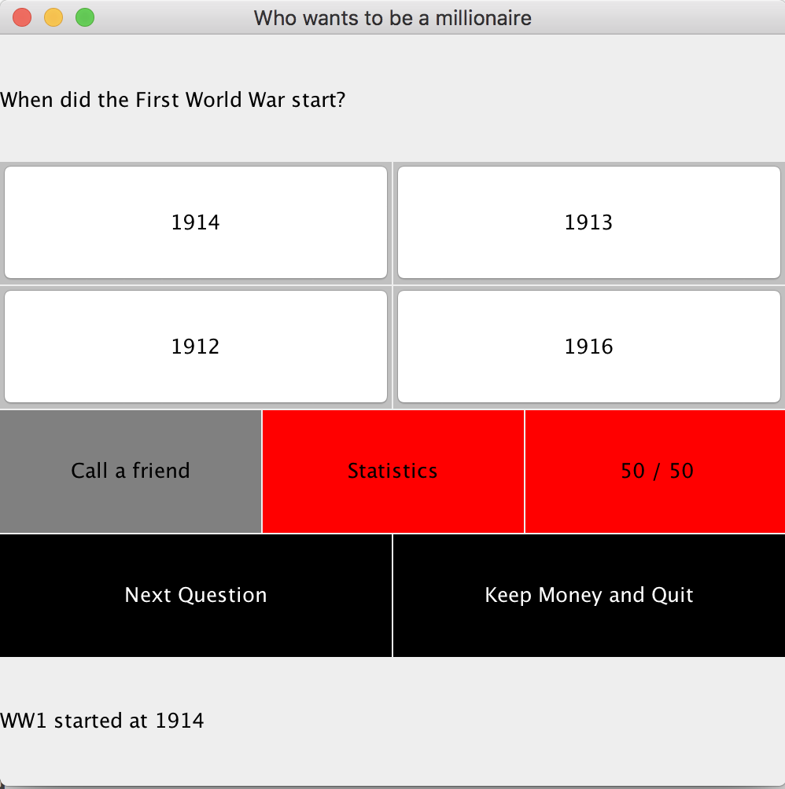
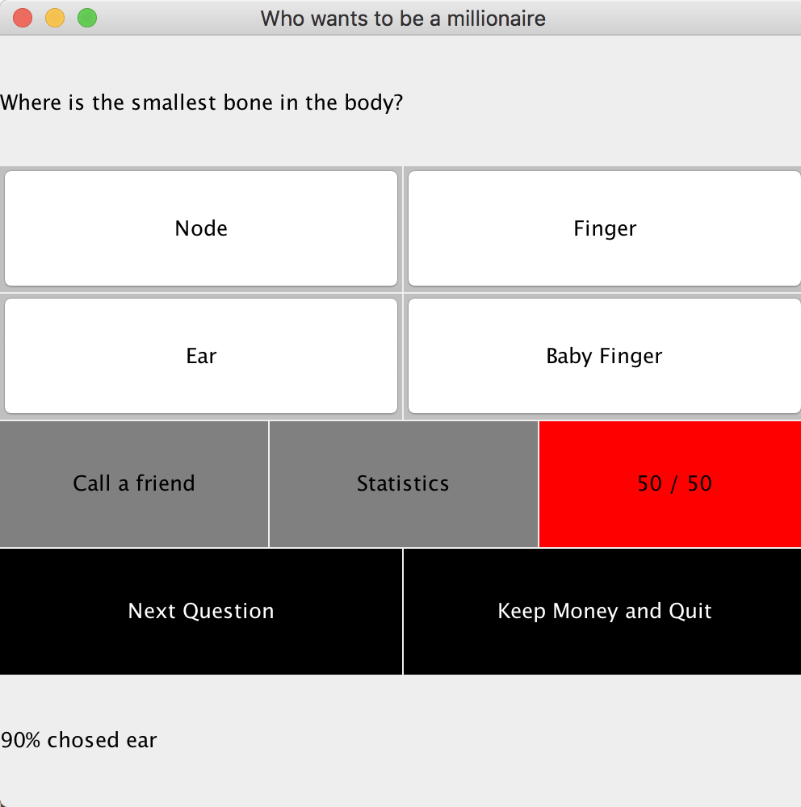
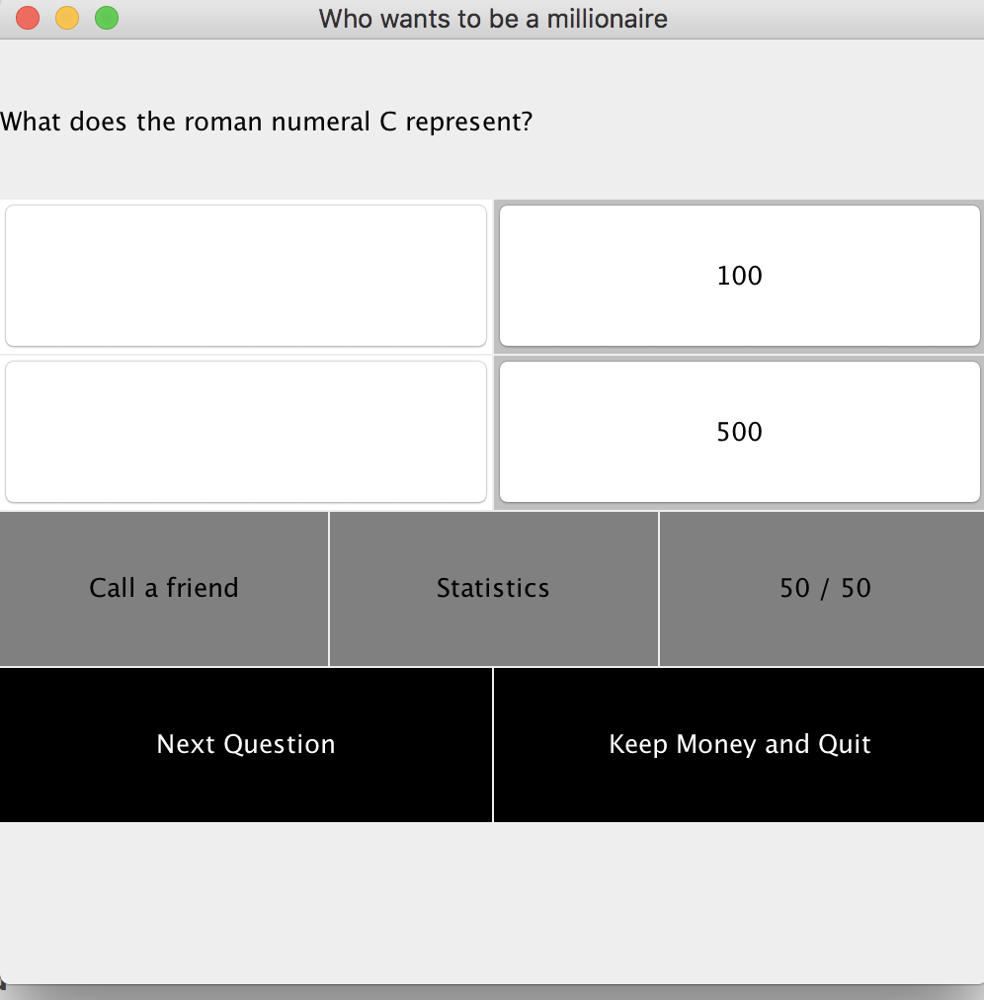
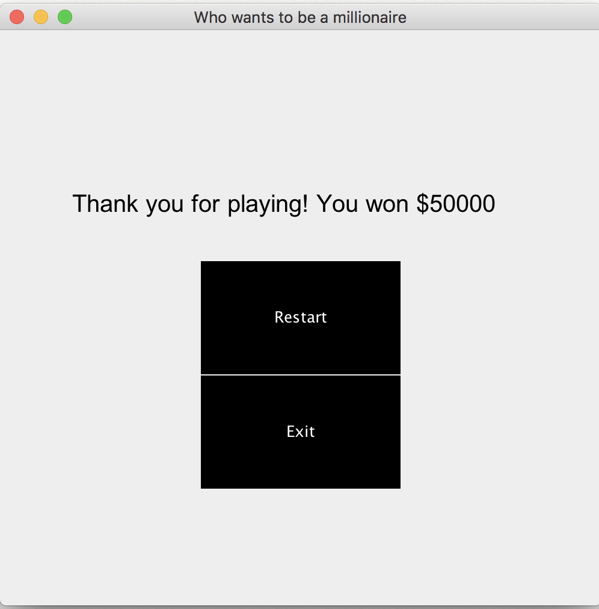
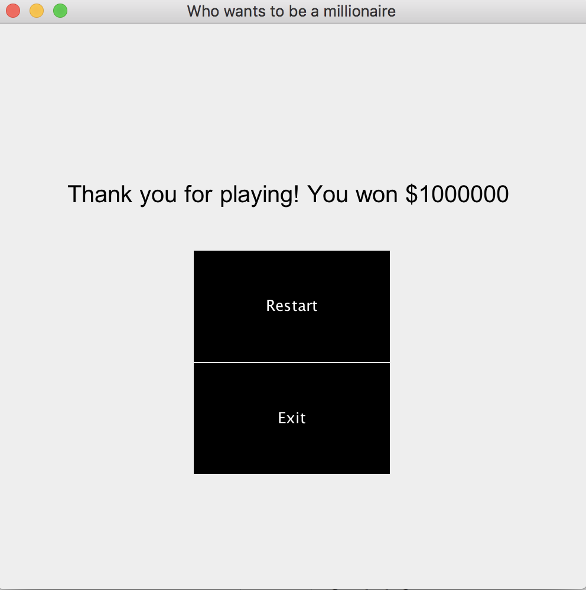

# Who Wants to be a Millionaire
Who wants to be a millionaire game, written in Java

As the game starts, the user sees the following screen:
* A question posed at the top of the screen 
* An empty 2x4 grid of possible answers
* 1x3 grid of the help available: call a friend, statistics and 50/50
* 1x2 grid with possible user options: quit with the money, and next question

If user picked the corrent answer, that cell will be covered green:

On the other hand, if an incorrect answer is clicked, the interface will change and present two options:
* restart
* exit

During the game, the user can choose to use any of the provided help options exactly once in a game.
For Calling a friend, a text will appear at the bottom of the page, static the friend's answer. The 'call a friend' cell is covered in grey to indicate its unavailability.

Using the statistics option, the 'statistics' cell is covered in grey to indicate its unavailability and a percentage is presented at the bottom of the interface:

Using the 50/50 option, the '50/50' cell is covered in grey to indicate its unavailability and two answer options on the board are eliminated:

At any point, the user can quit with money: 

If the user wins, he gets the following screen: 

* an executanle file can be found in the release tab

